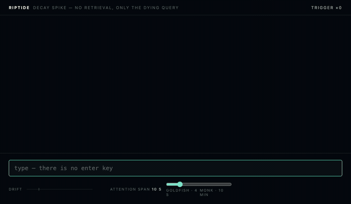

# Riptide

Every browser ever built assumes the query is finished before the search
begins. This one doesn't.



There is no Enter key. As you type, each token joins a live query with a
weight that decays exponentially:

```
wᵢ(t) = exp(−λ · (t − tᵢ))            weight decays from the moment of birth
live  = { i : wᵢ(t) > ε }             tokens below ε are dead, and stay dead
q(t)  = normalize( Σ live wᵢ(t)·vᵢ )  the query is a state, not a string
```

Retrieval fires when the query has *drifted* — when
`cosine(q(t), q_lastFetch) < θ` — never on a timer and never on a keypress,
subject to a hard rate floor. Type one coherent thought and the query vector
barely moves, so the screen goes calm. Leap between unrelated ideas and it
thrashes. Stop typing entirely and the screen keeps changing, because your
old words are still dying.

The chaos is proportional to your own incoherence. λ is the one dial:
**attention span**, from goldfish (4-second half-life) to monk (10 minutes).

## Try it

**[generaljudas.github.io/lucidBrowser](https://generaljudas.github.io/lucidBrowser/)**
— no install, just type.

The current spike shows the decaying query itself — every token at the
opacity of its own weight, dimming in real time, with the drift trigger
pinging when it fires. Retrieval is not wired in yet, and the spike's
embeddings are deterministic fakes: real static vectors arrive with M2.

To run it locally instead:

```
npm install
npm run dev
```

## How it holds together

- [`core/`](core) — the engine: a pure reducer `State × Event(t) → State`.
  Time is injected, never read; replaying a recorded event log is
  bit-identical, asserted by [golden fixtures](core/test/fixtures) and
  [property-based tests](core/test/properties.test.ts) over arbitrary
  keystroke timing. A lint rule fails the build if the core touches a clock.
- [`index/`](index) — HNSW vector index, Rust → WASM (skeleton; M3).
- [`pipeline/`](pipeline) — offline corpus pipeline, Python (skeleton; M2).
- [`app/`](app) — the spike: canvas renderer, thin DOM shell, no framework.
- [`docs/adr/`](docs/adr) — why each non-obvious decision went the way it
  did, alternatives included.
- [`docs/roadmap.md`](docs/roadmap.md) — what ships next and which goal it
  serves.

## Development

```
npm install        # workspaces: core + app
npm test           # property tests + golden replay
npm run lint       # includes the core no-clock/no-deps enforcement
npm run typecheck
npm run dev        # the spike, on a local port
```

`index/` is a pinned-Rust crate (`cargo test` inside it); `pipeline/` is
pinned-Python (`pip install -e './pipeline[dev]' && pytest pipeline`). CI
runs all three toolchains on every push.

MIT licence.
